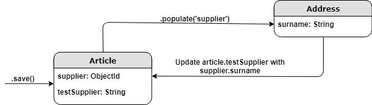
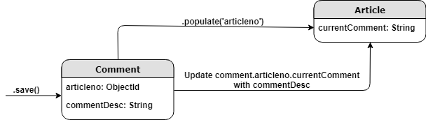
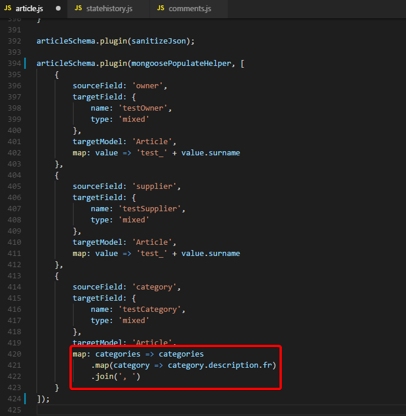
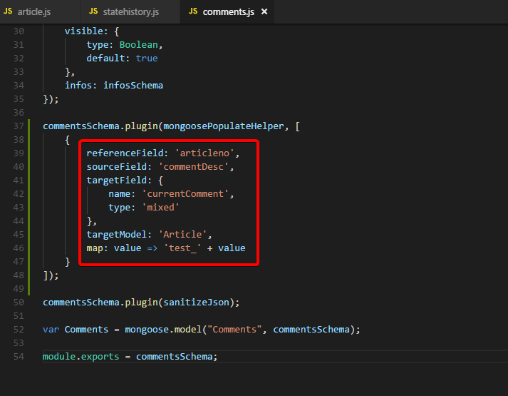
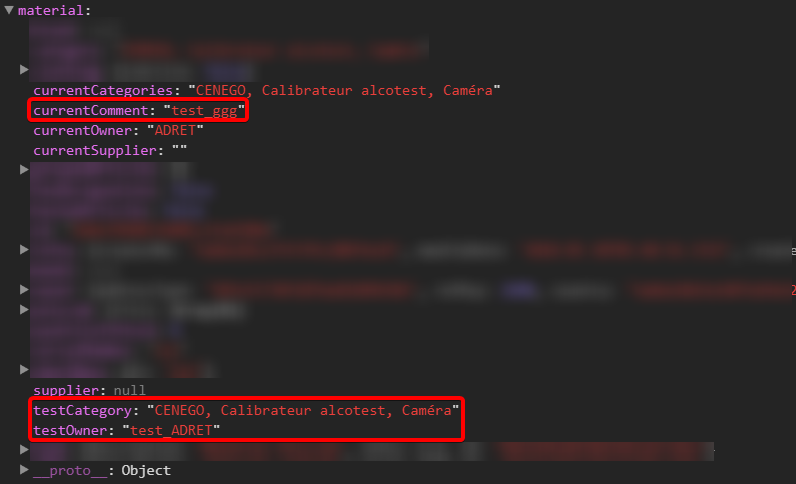

# mongoose-populate-helper
A mongoose plugin to facilitate population and sorting among others when referencing is used.

----------

## How to use

**Note: targetModel changed to targetSchema in v1.0.9.**

```ts
    articleSchema.plugin(mongoosePopulateHelper, configurations: Array<Object> || configuration: Object);

    configuration: {
        'sourceField': 
            '<Field that will be used in targetSchema to set targetField>',

        'targetField': 
            '<New field added to schema>',

        'map': 
            "<Function to map sourceField's value before assigning to targetField>",

        'targetSchema'?: 
            //default = schema using the plugin
            `<
            Schema from which value is taken (for type = 'local') 
            or 
            Schema to which value is assigned (for type = 'foreign')
            >`,

        'referenceField'?: 
            '<Used to get the document whose targetField will be updated>'
    }

    //'referenceField' and 'targetSchema' used => type = 'foreign'; ELSE, type = 'local'
```

### Type = 'local'
- Assignment is done in Schema using the plugin.

- Retrieval is done from targetSchema.

E.g.:




### Type = 'foreign'
- Assignment is done in targetSchema using **referenceField**.

- Retrieval is done from Schema using the plugin.

E.g.:



Example (local):



Example (foreign):


)

----------

## Result


----------

## Limitations
- Path implemented but not yet tested (except for configuration.targetField)

----------

## Notes
- Tested on MongoDB 3.2, Mongoose 4.5.9, NodeJS 8.11.1, NPM 5.6.0